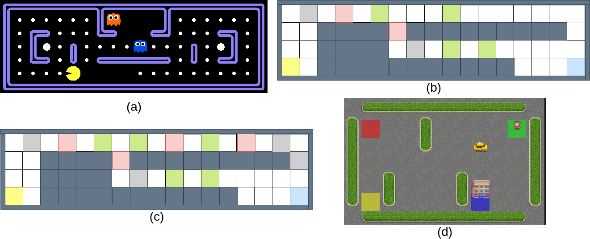

NPC Gym
=======

The **Normative Player Characters Gym** is a framework for implementing and evaluating normative RL agents.

Currently it contains versions of the Gymnasium environments *Pacman* (a), *Merchant* (b, c), and *Taxi* (d).



For each environment multiple norm bases are implemented, each consisting of one or more norms. Norm violations are registered and counted by *norm monitors*.


Prerequisites
-------------

To use the NPC Gym you need to prepare and activate a conda environment as follows:

```
conda env create -n npcgym -f environment.yml
conda activate npcgym
```


Reproducing the Baselines
-------------------------

You can reproduce the baseline experiments from our paper using the following commands. The respective scripts also serve as examples showcasing how to learn, load, and save models and evaluate them for norm violations.


### Pacman

For *learning* the **PPO** models:

```bash
python train_pacman.py ppo
```

Running this script creates a **stable-baselines3 PPO** policy in 
`pickles/models` with the prefix `ppo` and the suffix `<id>.zip`, where
`<id>` is an integer starting at 1. By default, the policy is trained 
for 2500000 steps (variable `steps` in Line 150). 

For *evaluating* the **PPO** models:

```bash
python eval_pacman.py ppo all all
```

This will evaluate all trained models with all available norm bases.
Alternatively, run the following command to evaluate a specific policy 
`<exp_id>` with a specific norm base `<nb>`.

```bash
python eval_pacman.py ppo <exp_id> nb
```

Analogously to **PPO**, for *learning* the **DQN** models use:

```bash
python train_pacman.py dqn
```

For *evaluating* the **DQN** models:

```bash
python eval_pacman.py dqn all all
```

The evaluation results are stored in JSON format in the directory
`eval_results`. The table from the paper can be reproduced using:

```bash
python eval_pacman_table.py
```

This script assumes results for both PPO and DQN. 


### Merchant

For *learning and evaluating* the models on the *basic* layout (b):

```bash
python train_merchant.py
```

For *learning and evaluating* the models on the *dangerous* layout (c):

```bash
LAYOUT="dangerous" python train_merchant.py
```


### Taxi

For *learning and evaluating* the models:

```bash
python train_taxi.py
```
